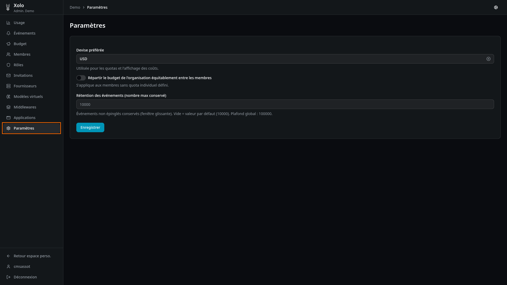

# Paramètres



## Qu'est-ce que les paramètres ?

Les paramètres permettent de configurer les réglages généraux de l'organisation : la devise utilisée pour les budgets et l'affichage des coûts, la répartition équitable du budget, et la rétention des événements.

## Accéder aux paramètres

1. Allez dans votre organisation : `/orgs/{slug}/`
2. Cliquez sur **Paramètres** dans le menu admin

> **Note** : Vous devez disposer de la permission `settings:write` pour modifier les paramètres.

## Devise préférée

La devise est utilisée pour les budgets et l'affichage des coûts dans l'interface.

### Devises disponibles

USD, EUR, GBP, JPY, CHF, CAD, AUD

### Impact sur les budgets existants

> **Attention** : La modification de la devise n'affecte pas les budgets existants. Elle s'applique uniquement :
> - Aux nouveaux budgets créés après la modification
> - À l'affichage des coûts dans l'interface
>
> Les budgets existants gardent leur valeur numérique ; seule l'interprétation change (ex : 100 devient 100€ au lieu de 100$).

Pour éviter toute confusion, il est recommandé de définir la devise dès la création de l'organisation.

## Répartir le budget équitablement

Activez l'option **Répartir le budget de l'organisation équitablement entre les membres** pour diviser automatiquement le budget de l'organisation par le nombre de membres.

**Exemple** : Acme Corp, 5 membres, 500 € de budget mensuel → 100 € par membre.

La page affiche un aperçu du budget partagé (journalier, mensuel, annuel selon ce qui est défini au niveau organisation) et le nombre de membres actuels.

> Cette option ne s'applique qu'aux membres sans quota individuel défini, et le partage est recalculé à chaque changement du nombre de membres. Pour la règle de priorité complète entre quota personnel et quota partagé, voir le concept [Budgets et quotas](../../../concepts/budgets-et-quotas.md).

## Rétention des événements

La rétention définit le nombre maximum d'événements conservés dans la fenêtre glissante.

### Champs

| Champ | Description |
|-------|-------------|
| **Rétention des événements** | Nombre max d'événements conservés (fenêtre glissante) |

### Comportement détaillé

| Situation | Comportement |
|-----------|-------------|
| **Champ vide** | Utilise la valeur par défaut de la plateforme |
| **Valeur positive** | Conserve les N événements les plus récents |
| **Événements épinglés** | Conservés indéfiniment, hors de la fenêtre glissante |
| **Plafond global** | Limite maximale imposée par la plateforme (ne peut pas être dépassée) |

### Fenêtre glissante

La fenêtre glissante est un mécanisme qui conserve automatiquement les événements les plus récents tout en supprimant les plus anciens :

```
┌─────────────────────────────────────────────────┐
│ Fenêtre glissante (ex: 1000 événements)        │
├─────────────────────────────────────────────────┤
│ [événement 1] [événement 2] ... [événement 1000] │
└─────────────────────────────────────────────────┘
     ↑ anciens              ↑ récents
            ↑ supprimés automatiquement
```

**Exemple** : Si vous avez 1500 événements et une rétention de 1000, les 500 événements les plus anciens sont automatiquement supprimés.

### Épingler des événements

Certains événements peuvent être "épinglés" (par exemple, ceux liés à une alerte déclenchée). Ces événements épinglés sont conservés indéfiniment et ne sont pas affectés par la fenêtre glissante.

## Permissions

| Action | Permission requise |
|--------|-------------------|
| Consulter les paramètres | `settings:read` |
| Modifier les paramètres | `settings:write` |
