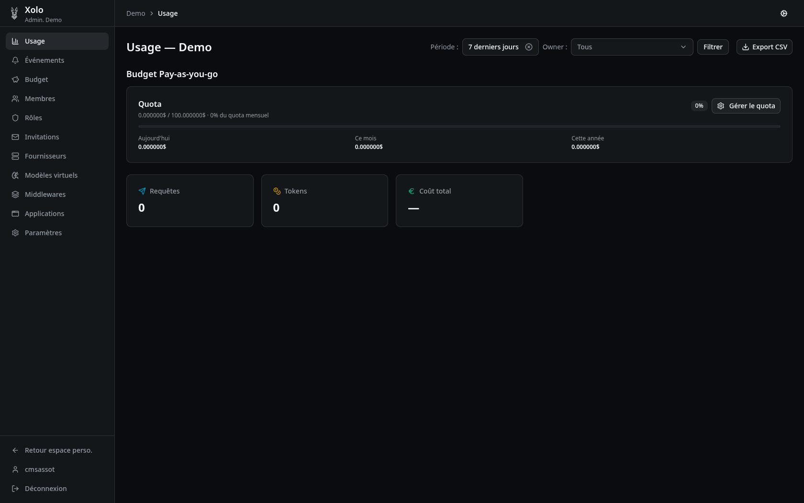

# Bienvenue dans Xolo

Xolo est une passerelle LLM souveraine pour l'entreprise. Elle vous permet de contrôler, surveiller et sécuriser l'accès aux modèles de langage au sein de votre organisation.

---

## Comment est organisée cette documentation

| Section | Pour qui ? | Contenu |
| --- | --- | --- |
| **[Utilisation](./utilisation/index.md)** | Tous les membres | Fonctionnalités du quotidien : tableau de bord, événements, alertes |
| **[Administration](./administration/index.md)** | Administrateurs, ops | Installation, déploiement, configuration technique et administration d'une organisation (budgets, rôles, fournisseurs, middlewares…) |
| **[Concepts](./concepts/index.md)** | Tous, pour aller plus loin | Principes transversaux de Xolo : modèle d'organisation, pipeline fournisseur → modèle → middleware, budgets, estimation énergétique, langage `eventql` |

## Prochaines étapes

1. **[Invitations](./administration/organisation/invitation/invitation.md)**. Invitez vos premiers utilisateurs.
2. **[Rôles](./administration/organisation/roles/roles.md)**. Définissez les permissions pour votre équipe.
3. **[Fournisseurs](./administration/organisation/fournisseurs/fournisseurs.md)**. Connectez vos services LLM préférés.
4. **[Budget](./administration/organisation/budget/budget.md)**. Définissez vos limites de dépenses.
