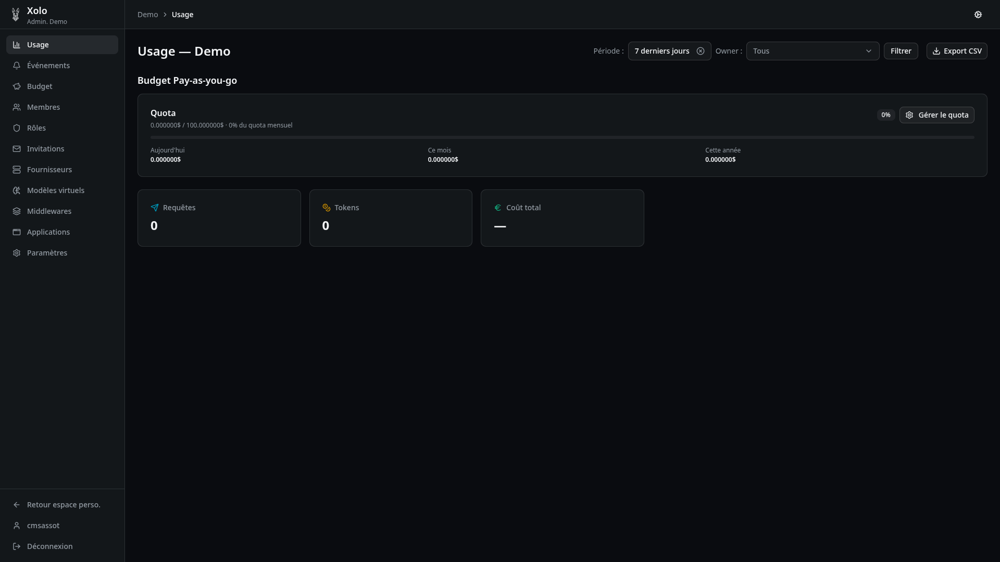

# Tableau de bord

## Qu'est-ce que le tableau de bord ?

Le tableau de bord (Dashboard) est votre interface principale pour visualiser l'utilisation de Xolo. Il affiche un récapitulatif de votre activité et de vos dépenses.

## Accéder au tableau de bord

1. Connectez-vous à Xolo
2. Vous êtes automatiquement redirigé vers le tableau de bord

URL : `/usage`

## Sélecteur de période

Choisissez la période d'affichage :

- **1j** — dernières 24 heures
- **7j** — 7 derniers jours
- **30j** — 30 derniers jours
- **90j** — 90 derniers jours
- **180j** — 180 derniers jours
- **365j** — année complète

### Exporter les données

Cliquez sur **Exporter CSV** pour télécharger les données au format CSV.

## Cartes de résumé

Le tableau de bord affiche des cartes récapitulatives :

| Métrique | Description |
|----------|-------------|
| **Requêtes** | Nombre total d'appels API effectués |
| **Tokens** | Total de tokens utilisés (dont cache) |
| **Coût total** | Dépense totale dans la devise de l'organisation |
| **Énergie** | Consommation estimée en watt-heures (Wh) |
| **CO2** | Émissions de CO2 avec équivalent en km parcourus |

## Graphiques

### Coût par jour

Histogramme affichant l'évolution des coûts journaliers sur la période sélectionnée.

### Coût par modèle

Répartition des coûts sous forme de camembert, par modèle utilisé.

### Coût par provider

Histogramme montrant la répartition des coûts par fournisseur LLM.

## Estimation énergétique et CO2

Les métriques **Énergie** et **CO2** sont calculées à partir du modèle utilisé, du nombre de tokens et du niveau d'infrastructure du fournisseur. Xolo convertit également les émissions en équivalent km parcourus en voiture pour faciliter la lecture.

Pour la méthodologie complète (formules, plages d'incertitude, sources), voir le concept [Estimation énergétique et carbone](../../concepts/estimation-energetique.md).

## Tableau des requêtes

Le bas du tableau de bord affiche une liste paginée des requêtes avec :

| Colonne | Description |
|---------|-------------|
| **Date** | Horodatage de la requête |
| **Modèle** | Modèle LLM utilisé |
| **Tokens** | Nombre de tokens consommés |
| **Coût** | Coût de la requête |

## Changer d'organisation

Si vous appartenez à plusieurs organisations, utilisez le menu déroulant dans l'en-tête pour basculer entre elles.

## Tableau de bord de l'organisation

En tant qu'administrateur, vous pouvez également accéder au tableau de bord de l'organisation :

URL : `/orgs/{slug}/usage`

Celui-ci affiche les mêmes informations mais pour l'ensemble de l'organisation.
